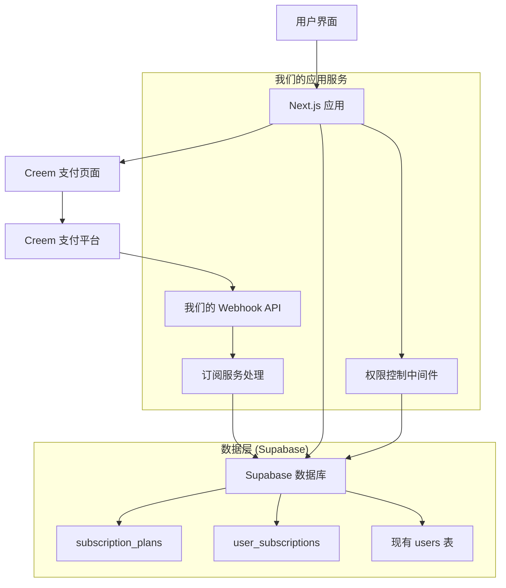

# Design Document

## Overview

本设计文档描述了将现有 Stripe 支付系统迁移到 Creem 支付平台的技术方案。系统将采用标准的 Creem Checkout Flow 集成方式，结合 Supabase 数据库来管理订阅套餐和用户订阅状态，实现基于订阅的权限控制系统。

## Architecture

### 系统架构图



### 核心流程

1. **支付流程**: 用户选择套餐 → 我们的应用创建 Creem 支付会话 → 重定向到 Creem 支付页面 → 用户完成支付 → Creem 回调我们的 Webhook API → 我们的服务更新 Supabase 订阅状态
2. **权限验证流程**: 用户请求 → 我们的权限中间件 → 查询 Supabase 订阅状态 → 允许/拒绝访问
3. **订阅管理流程**: 管理员配置套餐 → 存储到 Supabase subscription_plans → 前端从 Supabase 读取展示 → 用户选择购买

## Components and Interfaces

### 1. 数据库组件

#### subscription_plans 表
```sql
CREATE TABLE subscription_plans (
  id SERIAL PRIMARY KEY,
  name VARCHAR(100) NOT NULL UNIQUE,
  type VARCHAR(50) NOT NULL,
  price INT NOT NULL,
  currency VARCHAR(3) NOT NULL DEFAULT 'USD',
  period VARCHAR(50) NOT NULL,
  product_id VARCHAR(255),
  created_at TIMESTAMP WITH TIME ZONE NOT NULL DEFAULT CURRENT_TIMESTAMP
);
```

#### user_subscriptions 表
```sql
CREATE TABLE user_subscriptions (
  id SERIAL PRIMARY KEY,
  user_id INT NOT NULL,
  plan_id INT NOT NULL,
  start_date TIMESTAMP WITH TIME ZONE NOT NULL,
  end_date TIMESTAMP WITH TIME ZONE NOT NULL,
  payment_status VARCHAR(50) NOT NULL,
  payment_method VARCHAR(50),
  order_id VARCHAR(255),
  amount_paid DECIMAL(10, 2) NOT NULL,
  is_active BOOLEAN NOT NULL DEFAULT TRUE,
  created_at TIMESTAMP WITH TIME ZONE NOT NULL DEFAULT CURRENT_TIMESTAMP,
  updated_at TIMESTAMP WITH TIME ZONE
);
```

### 2. API 接口设计

#### /api/creem-checkout (新建)
```typescript
interface CreemCheckoutRequest {
  plan_id: number;
  success_url?: string;
  cancel_url?: string;
}

interface CreemCheckoutResponse {
  checkout_url: string;
  session_id: string;
}
```

#### /api/creem-webhook (新建)
**说明**: 这是我们应用提供的 webhook 端点，供 Creem 支付平台回调使用
```typescript
interface CreemWebhookPayload {
  event_type: 'payment.completed' | 'subscription.cancelled';
  session_id: string;
  customer_email: string;
  amount: number;
  currency: string;
  metadata: {
    user_id: string;
    plan_id: string;
  };
}

// 我们的 webhook 处理逻辑
async function handleCreemWebhook(payload: CreemWebhookPayload) {
  // 1. 验证 webhook 签名
  // 2. 根据 event_type 处理不同事件
  // 3. 更新 Supabase 中的 user_subscriptions 表
  // 4. 返回确认响应给 Creem
}
```

#### /api/subscription-plans (新建)
```typescript
interface SubscriptionPlan {
  id: number;
  name: string;
  type: string;
  price: number;
  currency: string;
  period: string;
  product_id: string;
}
```

### 3. 前端组件重构

#### Pricing 组件更新
- 移除 Stripe 相关代码
- 集成 Creem 支付流程
- 从 Supabase 获取套餐数据
- 移除 wechat_pay、alipay 支付选项

#### 权限控制组件
```typescript
interface SubscriptionGuard {
  requiredPlan?: string[];
  fallbackComponent?: React.ComponentType;
  children: React.ReactNode;
}
```

### 4. 服务层设计

#### SubscriptionService
```typescript
class SubscriptionService {
  // 从 Supabase 查询用户当前有效订阅
  async getUserActiveSubscription(userId: number): Promise<UserSubscription | null>
  
  // 在 Supabase 中创建新的订阅记录
  async createSubscription(data: CreateSubscriptionData): Promise<UserSubscription>
  
  // 更新 Supabase 中的订阅状态（通常由 webhook 触发）
  async updateSubscriptionStatus(subscriptionId: number, status: string): Promise<void>
  
  // 检查用户是否有访问特定功能的权限
  async checkUserPermission(userId: number, requiredPlan: string): Promise<boolean>
}

#### CreemService
```typescript
class CreemService {
  // 创建 Creem 支付会话，返回支付页面URL
  async createCheckoutSession(planId: number, userId: number): Promise<CreemSession>
  
  // 验证来自 Creem 的 webhook 签名
  async verifyWebhook(payload: string, signature: string): Promise<boolean>
  
  // 处理 Creem webhook 事件，更新我们的 Supabase 数据库
  async handleWebhookEvent(event: CreemWebhookEvent): Promise<void>
}
```

## Data Models

### 订阅套餐模型
```typescript
interface SubscriptionPlan {
  id: number;
  name: string;
  type: 'basic' | 'pro' | 'premium';
  price: number;
  currency: string;
  period: 'monthly' | 'yearly';
  product_id: string;
  features: string[];
  created_at: Date;
}
```

### 用户订阅模型
```typescript
interface UserSubscription {
  id: number;
  user_id: number;
  plan_id: number;
  start_date: Date;
  end_date: Date;
  payment_status: 'pending' | 'completed' | 'failed' | 'refunded';
  payment_method: string;
  order_id: string;
  amount_paid: number;
  is_active: boolean;
  created_at: Date;
  updated_at: Date;
}
```

### Creem 会话模型
```typescript
interface CreemSession {
  session_id: string;
  checkout_url: string;
  customer_email: string;
  amount: number;
  currency: string;
  metadata: {
    user_id: string;
    plan_id: string;
  };
}
```

## Error Handling

### 支付错误处理
1. **网络错误**: 显示重试按钮，记录错误日志
2. **支付失败**: 显示具体错误信息，提供客服邮箱联系方式 (support@flux1-krea.dev)
3. **会话过期**: 自动重新创建支付会话
4. **权限不足**: 重定向到升级页面

### Webhook 错误处理
1. **签名验证失败**: 返回 401 状态码，记录安全日志
2. **数据格式错误**: 返回 400 状态码，记录错误详情
3. **数据库操作失败**: 返回 500 状态码，触发重试机制
4. **重复事件**: 幂等性处理，避免重复操作

### 权限验证错误处理
1. **用户未登录**: 重定向到登录页面
2. **订阅已过期**: 显示续费提示
3. **套餐不匹配**: 显示升级选项
4. **系统错误**: 显示友好错误页面

## Testing Strategy

### 单元测试
- **服务层测试**: 测试 SubscriptionService 和 CreemService 的所有方法
- **模型测试**: 测试数据模型的验证逻辑
- **工具函数测试**: 测试权限检查、日期计算等工具函数

### 集成测试
- **API 端点测试**: 测试所有新建的 API 路由
- **数据库操作测试**: 测试 CRUD 操作的正确性
- **Webhook 处理测试**: 模拟 Creem webhook 事件

### 端到端测试
- **完整支付流程测试**: 从选择套餐到支付完成的全流程
- **权限控制测试**: 测试不同订阅状态下的功能访问
- **订阅管理测试**: 测试订阅的创建、更新、取消流程

### 性能测试
- **并发支付测试**: 测试系统在高并发支付场景下的表现
- **数据库查询优化**: 确保订阅状态查询的性能
- **缓存策略测试**: 测试订阅状态缓存的有效性

### 安全测试
- **Webhook 安全测试**: 测试签名验证和防重放攻击
- **权限绕过测试**: 尝试绕过订阅验证访问付费功能
- **SQL 注入测试**: 测试所有数据库查询的安全性

## Migration Strategy

### 数据迁移
1. **创建新表**: 在 Supabase 中创建 subscription_plans 和 user_subscriptions 表
2. **用户状态迁移**: 更新 users 表中的 plan 字段以反映新的订阅状态
3. **清理旧代码**: 移除现有 orders 表相关的代码逻辑

### 代码迁移
1. **阶段1**: 创建新的 Creem 集成代码，保持 Stripe 代码不变
2. **阶段2**: 更新前端组件使用新的支付流程
3. **阶段3**: 移除 Stripe 相关代码和依赖
4. **阶段4**: 清理旧的数据库字段和API端点

### 部署策略
1. **功能开关**: 使用环境变量控制新旧支付系统的切换
2. **灰度发布**: 先对部分用户启用新支付系统
3. **监控告警**: 设置关键指标监控，及时发现问题
4. **回滚方案**: 准备快速回滚到 Stripe 系统的方案